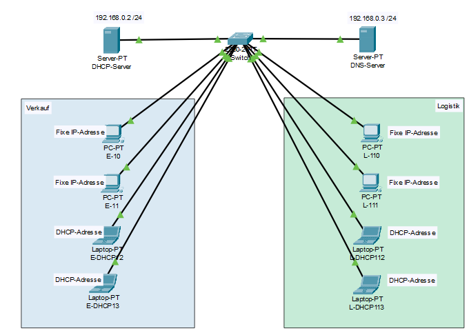
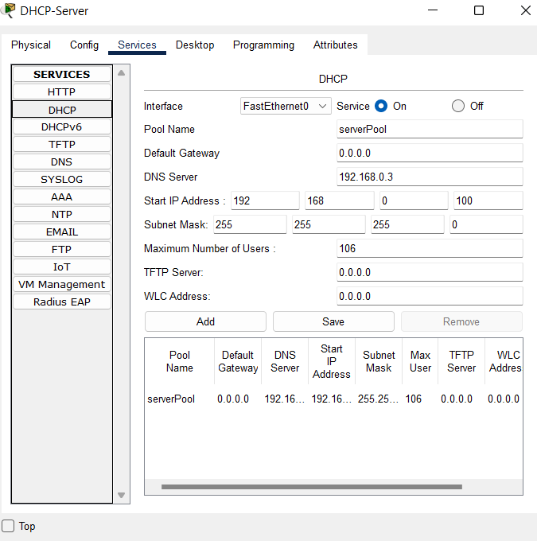
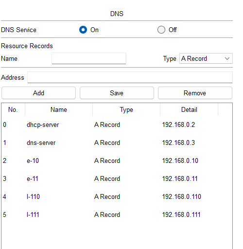
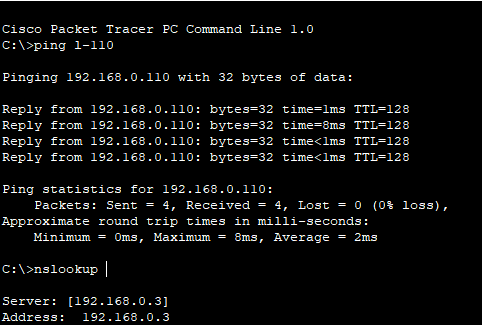

## Cisco Pakter Tracer
###### Modul 123 – Hands-on Challenge -„Serverdienste DHCP und DNS für ein KMU einrichten
###### Author: Rayan Lee Bopp

#### Verkabeln

Die einzelnen Geräte mit einem Kupfer-Kabel verbinden

#### DHCP Konfigurieren

Den DHCP-Server Konfigurieren
Lege den IP-Pool fest von 192.168.0.150 - 192.168.0.200. Lege ausserde noch den DNS-Server fertig.

#### DNS Konfigurieren

Den DNS-Server Konfigurieren hinterlege die einzelnen fix IP PCs.

#### Überprüfung

Zur Überprüfung, dass alle Sachen funktionieren hier ein Screenshot.

