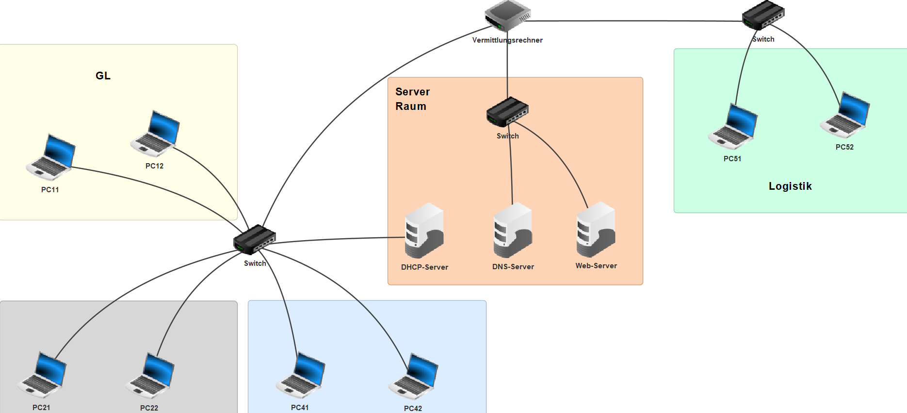
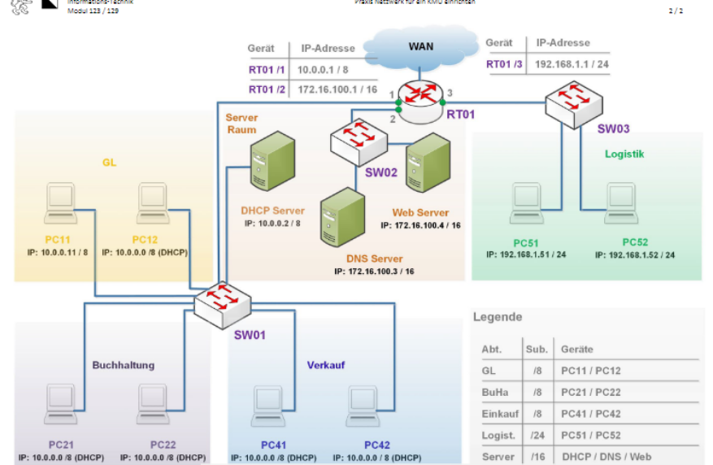
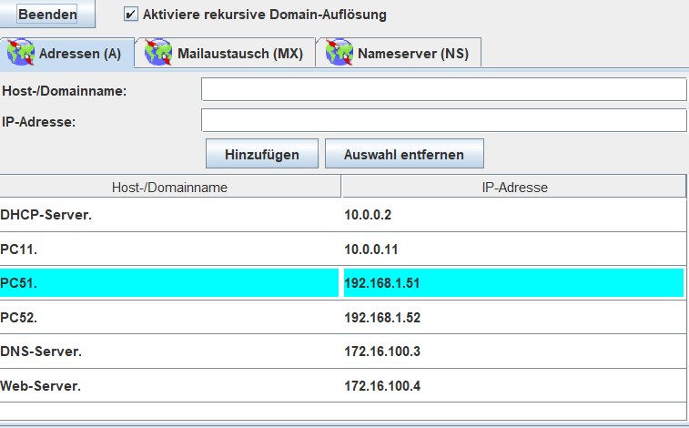
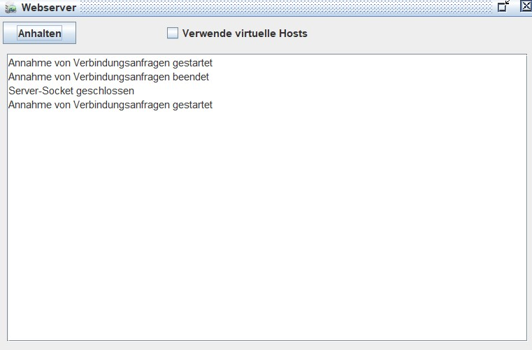
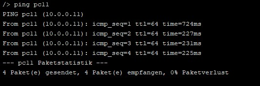
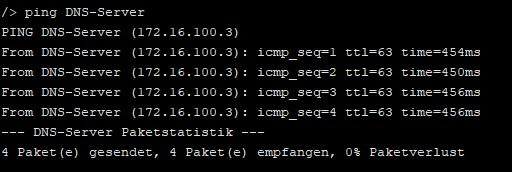
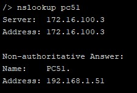

## Filius Last Challenge
Rayan Lee Bopp
24.01.2023



#### Mein Ablauf

Als erstes analysierte ich die Situation ich wusste ich hatte 6 Geräte die eine Statische Adresse brauchten, 3 Computer und 3 Server.
Die anderen 5 Computer bekommen eine IP-Adresse von dem DHCP Server zugeteilt.
Danach überlegte ich wie gross der DHCP-IP-Pool sein muss um alle PCs unterstützen zu können ich kam zum entschluss, dass die Range `10.0.0.4 - 10.0.0.10` sein muss.

##### Erster Schritt

Mein erster Schritt, den ich gemacht habe ist, alle Geräte wie in der Grafik zu verbinden. siehe unten stehende Grafik.


##### Zweiter Schritt - Konfigurieren

Als zweiter Schritt konfigurierte ich die Computer der Abteilung Geschäftsleitung, Buchhaltung, Logistik und Verkauf.
Wie schon erwähnt habe ich 3 Computer die eine Statische IP-Adresse haben und 5 die eine IP-Adresse die von dem DHCP-Server zugewiesen werden.

##### Dritter Schritt

Als dritter Schritt habe ich die Server Konfiguriert.

###### Dritter Schritt - DHCP-Server Konfigurieren


Ich habe hier den DHCP-Server Konfiguriert, wie man hier sieht habe ich eine Adress-Untergrenze von 10.0.0.3 angegeben und eine Adress-Obergrenze von 10.0.0.10 mit einer Netzmaske von 255.0.0.0. Das Gateway habe ich auch gerade schon angegeben, da ich dies aus der Grafik ablesen konnte.

###### Dritter Schritt - DNS-Server Konfigurieren


Wie man in dem hier in diesen Screenshot sieht habe ich jedes Statisches Gerät in den DNS Eingeträgen und die Funktion `Aktiviere rekursive Domain-Auflösung` aktiviert.
Dies erlaubt es mir eine Ping anfrage auf die folgenden Geräte mit namen zu machen.

###### Dritter Schritt - Web-server Konfigurieren


Ich habe bei dem Webserver nicht wirklich viel gemacht, da ich eigentlich nur das Software Packet installiert habe und den Webserver aktiviert habe.

##### Vierter Schritt


Wie man oben sieht habe ich den Router Konfiguriert, Hier sieht man eine der drei Verbindungen. In diesem Falle geht diese Verbindung zum CIDR /8 Netzwerk in dem der DHCP-Server ist.

##### Test

Da ich jetzt alle Netzwerkgeräte Konfiguriert habe, sollte ich jetzt in der Lage sein die einzelnen Geräte dank des DNS namentlich anzupingen.

###### Erster Test PC41 pingt PC11


In diesem Falle habe ich von dem Computer, der eine IP-Adresse von dem DHCP-Server erhalten hat einen Computer mit einer Statischen IP angepingt.

Die PC haben folgende Adressen
````
PC11 - 10.0.0.11
PC41 - DHCP
````

###### Zweiter Test PC51 pingt DNS-Server


In diesem Test habe ich den PC51 für einen Ping benützt, der PC51 hat eine statische IP-Adresse. Ich pingte in diesem Test den DNS-Server an.
````
PC51        192.168.1.51
DNS-Server  172.16.100.3
````

###### Dritter Test PC PC51 NSLOOKUP


In diesem Test habe ich geschaut, ob der DNS-Server überhaupt funktioniert und siehe da er funktioniert.

````
PC51        192.168.1.51
DNS-Server  172.16.100.3
````
