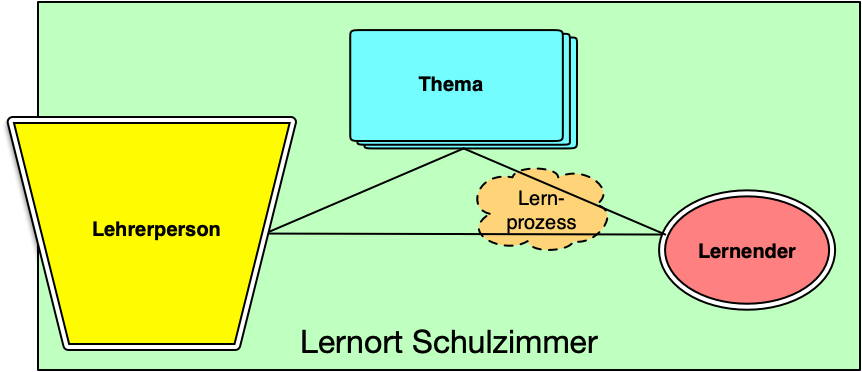

## SOL - selforiented learning

#### what is SOL? - selforiented learning

Selforiented learning. What is it exactly. As the name may already suggest. SOL or written out selforiented learning is a method for efficient learning new subjects or making immense progress in a group or solo-project. Therefore the student studies on his/her own way and manner, hence the name selforiented learning. See the graphic below.

#### for what purpose? - selforiented learning

What purpose does selforiented learning. Fair to say it is not as straight forward as other questions. But keeping it simple the answer to this question is highly dependable on the current demands of the jobmarket. They want dependable people that can learn on their own, meaning that they are independent people learning all on their own. 

#### what roles are present? - selforiented learning

* The student becomes a "explorer". He/She controls her own learningprocess. The student works in a "tandem-team", meaning everyone and everybody has his own partner.

* The teacher becomes a "coach". The coach closely follows the lernprocess of the student.

* The teacher also becomes the "expert", taking account of competency.

